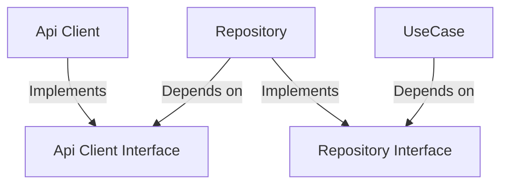

# API Layer

このドキュメントでは、当プロジェクトにおけるAPI Layerの設計と実装について説明します。

## 概念図



## ディレクトリ構成

``` bash
api
├── client
│   ├── index.ts      # Api Clientの実装
│   └── interface.ts  # Api ClientのInterface
├── domain
│   └── index.ts      # ドメインの型定義
├── repository
│   ├── converters.ts # データ形式の変換
│   ├── index.ts      # Repositoryの実装
│   └── interface.ts  # RepositoryのInterface
├── types
│   ├── data.ts       # アプリケーションでの表示や操作に適したデータの型定義
│   ├── values.ts     # ユーザーの入力した値やAPIのリクエストに適したデータの型定義
│   ├── requests.ts   # APIのリクエストの型定義
│   └── responses.ts  # APIのレスポンスの型定義
├── usecases
│   └── index.ts      # Use Caseを表現するReact Hooks
```

``` bash
model
└── index.ts # オブジェクトのモデル
```

## 各構成要素

### Api Client Interface

Api Client Interfaceは、Api Clientの実装を抽象化したものです。

```typescript filename="api/client/interface.ts"
export interface ApiClientInterface {
  fetch(params: GetUsersRequest): Promise<GetUsersResponse>;
  create(request: PostUsersRequest): Promise<PostUsersResponse>;
}
```

### Api Client

Api Clientは、Api Client Interfaceを実装し、HTTP requestの送信やサーバーからのレスポンスを受け取る役割を果たします。これは、Fetch APIやXMLHttpRequestを使って行われます。Api Clientの責務は、APIとの通信に限定され、データ加工やビジネスロジックは含まれません。

```typescript filename="api/client/index.ts"
class ApiClient implements ApiClientInterface {
  httpClient: HttpClient;

  constructor(httpClient: HttpClient) {
    this.httpClient = httpClient;
  }

  public async fetch(params: GetUsersRequest): Promise<GetUsersResponse> {
    const response: GetUsersResponse = await this.httpClient.get('users', { searchParams: params }).json();
    return response;
  }

  public async create(request: PostUsersRequest): Promise<PostUsersResponse> {
    const response: PostUsersResponse = await this.httpClient.post('users', { json: request }).json();
    return response;
  }
}

export const apiClient = new ApiClient(httpClient);
```

### Repository Interface

Repository Interfaceは、Repositoryの実装を抽象化したものです。

```typescript filename="api/repository/interface.ts"
export interface RepositoryInterface {
  fetch: (values: GetUsersValues) => Promise<GetUsersData>;
  create: (values: PostUsersValues) => Promise<PostUsersData>;
}
```

### Repository

Repositoryは、アプリケーション内でデータ操作を管理する役割を担っています。RepositoryはRepository Interfaceを実装する必要があり、このInterfaceでは、データの取得、作成、更新などの操作が定義されています。

Repositoryは、Api Client Interfaceの依存性を注入することで、Api Clientの実装に依存しないように設計されています。このアプローチにより、API通信の具体的な実装を隠蔽し、API通信との分離を図っています。これによって、柔軟性が向上し、テストも容易になります。

また、Repositoryは、受け取ったデータをApi Client向けのリクエスト形式に変換し、Api Clientからのレスポンスをアプリケーション内で使用できるデータ形式に変換して返す役割も担っています。

まとめると、Repositoryは以下のような役割を果たしています。

- データの取得、作成、更新、削除などの操作を行う
- API通信の実装詳細を隠蔽し、API通信との分離を図る
- データをApi Client向けのリクエスト形式に変換する
- Api Clientからのレスポンスをアプリケーション内で使用できるデータ形式に変換する

```typescript filename="api/repository/index.ts"
class Repository implements RepositoryInterface {
  apiClient: ApiClientInterface;

  constructor(apiClient: ApiClientInterface) {
    this.apiClient = apiClient;
  }

  public async fetch(values: GetUsersValues): Promise<GetUsersData> {
    const request = convertValuesToGetRequest(values);
    const response = await this.apiClient.fetch(request);
    const convertedData = response.data.map((item) => convertGetResponseToData(item));
    return {
      data: convertedData,
    };
  }

  public async create(values: PostUsersValues): Promise<PostUsersData> {
    const request = convertValuesToPostRequest(values);
    const response = await this.apiClient.create(request);
    const convertedData = convertPostResponseToData(response.data);
    return {
      data: convertedData,
    };
  }
}

export const repository = new Repository(apiClient);
```

### Use Case

Use Caseは、ユーザーがアプリケーションで実現したい機能やシナリオを表現したものです。
React Hooksとして実装され、コンポーネントから呼び出されることを前提としています。
キャッシュ機能を提供するライブラリ（例: SWR, React Query）と組み合わせて使用され、取得したデータのキャッシュ管理もUse Caseが担います。

Use Caseは、Repositoryのメソッドを利用してデータの取得や変更を実行します。
以下の例では、ユーザーの取得と作成に関するユースケースを示しています。

```typescript filename="api/usecases/index.ts"
export const useGetUsers = (values: GetUsersValues) => {
  return useQuery<GetUsersData, Error>({
    queryKey: ['GetUsers', values],
    queryFn: () => repository.fetch(values),
  });
};

export const useMutateUsers = () => {
  const createUsers = useMutation((values: PostUsersValues) => repository.create(values));
  return { createUsers };
};
```

TODO: [キャッシュ管理の実装例と説明](https://zenn.dev/yoshiko/articles/91a3dd575f99a2#cache.ts), [Query Key Factoryの実装](https://tanstack.com/query/v4/docs/react/community/lukemorales-query-key-factory), Repositoryに依存しない実装にする

### Domain

システムのドメインを表現したものであり、RequestsやResponsesの型生成に使用されます。

```typescript filename="api/domain/index.ts"
export interface User {
  id: number;
  name: string;
  age: number;
}
```

### Model

オブジェクトのモデルを表現したものであり、ValuesやDataの型生成に使用されます。

```typescript filename="model/index.ts"
export interface User {
  id: string;
  name: string;
  age: string;
}
```

## 参考

- [フロントエンドアーキテクチャの話: Resource Setの紹介](https://zenn.dev/yoshiko/articles/91a3dd575f99a2)
